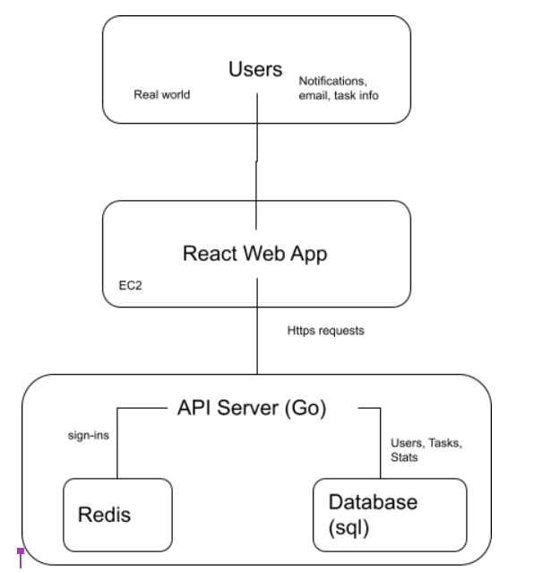

# Project Description

People get busier and busier as they get older - it is a known fact that there is a direct correlation between age and number of responsibilities. With busy lifestyles comes absent mindedness - how are we supposed to remember to do all these things? Our app attempts to solve this issue by relieving the stress of having to remember every little task.

Our general target audience will be for people that have busy lifestyles. More specifically, millennials who need a better way to be reminded of what is due. While there are other to-do lists on the market, they usually save their most valuable features for their paying customers. Other apps are free, but they usually aren’t made specifically as todo lists. Neither of the aforementioned solutions allow the user to see their metrics. As a result, there is a real need for a simple and reliable free todo list tracker.

As developers, we want to develop an application that serves our target audience by providing a central place to keep track of their tasks, efficiency and performance. In addition, our target audience will be able to share their tasks among each other, allowing for more flexibility and for tasks to be transferrable.

# Technical Description



| Priority | User                                    | Description                                                                                                                       |
| -------- | --------------------------------------- | --------------------------------------------------------------------------------------------------------------------------------- |
| P0       | As a logged in and non-logged in user   | I want to create a shareable link of my current todo list and share it with other. people.                                        |
| P1       | As a logged in and non-logged recipient | I want to use the shared link to append the shared tasks to my own todo. list.                                                    |
| P2       | As a non-logged in user                 | I want to create a bunch of tasks/reminders and have the data persists until I close my browser or lost track of my session's id. |
| P3       | As a logged in user                     | I want to be able to view my stats (items completed all time, completion rate).                                                   |

## Implementation Strategy

P0: The sender can create a shareable link using the following resource path: ```/tasks/import/{userID}```. For logged in user, the ```userID``` is their account's id. For non-logged in user, when they send a request without a session or 'Authorization' header, a temporary account and new session will be created. The ```userID``` for the non-logged in user is their temporary account's id. Both regular and temporary accounts are stored in ***MySQL*** database, and sessions are stored in ***Redis*** database.

P1: The recipient can click on the ```/tasks/import/{userID}``` link and it will append the requested user's todo list to the recipient's todo list. Tasks marked as hidden by the owner/requested user will not show up in the recipient's todo list.

P2: If the user is not logged in, we will create a temporary account with the username and password set to the session's id. This temporary account has limited function, and will only persist until we clean up the database or the user lost track of their session's id.

P3: The user can follow the resource path: ```/stats```, to view their computed statistic of their todo list's performance. The data will be pulled from the ***MySQL*** database and computation will be done on the front-end with ***JavaScript*** and ***React***.

## Endpoints

* ```/tasks```: refers all tasks
  * ```GET```: Reponse with a JSON array of the current user's todo list and status code ```200```.
  * ```POST```: Create a new task to the current user's todo list, then response with a JSON object of the newly-created task and status code ```201```. If the request's content type is not ```application/json```, then it will response with status code ```415```. If the task already existed or request's content body is invalid, then it will repsonse with status code ```400```.
* ```/tasks/{taskID}```: refers to a specific task. If the task is not found, then it will response with status code ```404```.
  * ```GET```: Reponse with a JSON object of the requested task and status code ```200```. If the task is hidden and the current user is not the owner, then it will response with status code ```401```.
  * ```PATCH```: Update an existing task, then response with a JSON object of the newly-updated task and status code ```200```. If the request's content type is not ```application/json```, then it will response with status code ```415```. If the request's content body is invalid, then it will response with status code ```400```. If the current user is not the owner of the requested task, then it will response with status code ```401```.
  * ```DELETE```: Delete an existing task, then response with status code ```200```. If the current user is not the owner of the requested task, then it will response with status code ```401```.
* ```/tasks/import/{userID}```: refers to importing another user's todo list
  * ```GET```: Append the requested user's todo list to the current user's todo list, and reponse with a JSON array of the newly-appened todo list and status code ```201```. If the requested user is not found, then it will response with status code ```404```. Any tasks in the requested user's todo list that are marked as hidden will be included in the response result.
* ```/stats```: refers to all stats of the current user
  * ```GET```: Response with a JSON object of the current user's stats. If the user not logged in, then it will response with status code ```401```.
* ```/stats/{property}?start={startDate}&end={endDate}```: refers to specific properties of a stat of the current user
  * ```GET```: Reponse with a JSON object of the requested stats property. If the user it not logged in, then it will response with status code ```401```. ```property``` can be ```year```, ```month```, ```week```, and ```custom```. Only ```custom``` property accepts ```start``` and ```end``` query arguments.
* ```/users```: refers to all users
  * ```POST```: Create a new user, then response with a JSON object of the newly-created user and status code ```201```. If the user already existed or request's content body is invalid, then it will response with status code ```400```.
* ```/users/{userID}```: refers to a specific user
  * ```GET```: Response with a JSON object of the requested user and status code ```200```. If the user is not logged in, then it will response with status code ```401```. If the user is not found, then it will response with status code ```404```. The ```userID``` can be ```me``` which refers to the current user.
  * ```PATCH```: Update an existing non-temporary user, then response with a JSON object of the newly-updated user and status code ```200```. If the request's content type is not ```application/json```, then it will response with status code ```415```. If the request's content body is invalid, then it will response with status code ```400```. If the requested user is not the current user or ```userID``` is not equal to ```me```, then it will response with status code ```403```. If the requested user is a temporary user, then it will response with status code ```401```.
* ```/sessions```: refers to all sessions
  * ```POST```: Create a new session, then response with a JSON object of the logged-in user and status code ```201```. If the request's content type is not ```application/json```, then it will response with status code ```415```. If the credentials is invalid, then it will response with status code ```401```.
* ```/sessions/{sessionID}```: refers to a specific session
  * ```DELETE```: Delete the requested session, then response with status code ```200```. If the ```sessionID``` is not equal to ```mine```, then it will return with status code ```403```.

## Appendix

```
CREATE TABLE IF NOT EXISTS User (
	ID BIGINT NOT NULL AUTO_INCREMENT PRIMARY KEY,
	Username  VARCHAR(255) NOT NULL UNIQUE,
	PassHash  CHAR(72) NOT NULL,
	FirstName VARCHAR(255),
	LastName  VARCHAR(255),
	IsTemporary BOOL DEFAULT FALSE NOT NULL
);

CREATE TABLE IF NOT EXISTS TodoList (
	ID BIGINT NOT NULL AUTO_INCREMENT PRIMARY KEY,
	UserID BIGINT NOT NULL,
	Name VARCHAR(255) NOT NULL,
	Description VARCHAR(1000),
	IsComplete BOOL NOT NULL,
	IsHidden BOOL NOT NULL,
	CreatedAt DATETIME DEFAULT CURRENT_TIMESTAMP NOT NULL,
	EditedAt DATETIME DEFAULT CURRENT_TIMESTAMP ON UPDATE CURRENT_TIMESTAMP NOT NULL,
	FOREIGN KEY (UserID) REFERENCES User (ID)
);

DELIMITER //
CREATE PROCEDURE DeleteUser (IN p_ID BIGINT)
BEGIN
	IF NOT EXISTS (SELECT * FROM User WHERE ID = p_ID) THEN
		SIGNAL SQLSTATE '45000'
			SET MESSAGE_TEXT = 'user not found';
	END IF;
	START TRANSACTION;
	DELETE FROM TodoList WHERE UserID = p_ID;
	DELETE FROM User WHERE ID = p_ID;
	COMMIT;
END;//
DELIMITER ;
```
